# 🎵 Spotify End-to-End Data Pipeline

An automated, event-driven data engineering pipeline that extracts data from the Spotify API, transforms it using AWS Lambda, loads it into Snowflake via Snowpipe, and makes it available for analytics — with zero manual intervention after deployment.

---

## 📐 Architecture




---

## 🛠️ Tech Stack

| Component | Technology |
|-----------|-----------|
| Data Source | Spotify Web API via `spotipy` |
| Scheduling | Amazon CloudWatch Events |
| Compute | AWS Lambda (Python 3.x) |
| Storage | Amazon S3 |
| Data Warehouse | Snowflake |
| Auto Ingestion | Snowpipe |
| Languages | Python, SQL |
| Key Libraries | `pandas`, `boto3`, `spotipy` |

---

## 📁 Project Structure

```
spotify-etl-pipeline/
├── lambda/
│   ├── extraction/
│   │   └── lambda_function.py       # Spotify API → S3 raw
│   └── transformation/
│       └── lambda_function.py       # S3 raw → S3 transformed
├── snowflake/
│   ├── setup.sql                    # DB, tables, integration, stage, pipes
│   └── analytics.sql                # Analytics schema and views
└── README.md
```

---

## 🔄 Pipeline Walkthrough

### Stage 1 — Extract
- CloudWatch Events fires the extraction Lambda **once daily**
- Lambda connects to the Spotify API using `spotipy` and pulls playlist track data
- Raw JSON response is written to `s3://bucket/raw_data/to_process/`
- Each file is timestamped: `spotify_raw_2026-06-07 23:45:46.json`

### Stage 2 — Transform
- An **S3 ObjectCreated trigger** fires the transformation Lambda the moment a file lands in `to_process/`
- The Lambda reads the **exact file** from the S3 event object (not a folder scan)
- Raw JSON is parsed and normalised into three DataFrames:

| Table | Key Fields |
|-------|-----------|
| `song` | song_id, name, duration_ms, popularity, added_at, album_id, artist_id |
| `artist` | artist_id, name, external_url |
| `album` | album_id, name, release_date, total_tracks, external_url |

- Each DataFrame is written as a CSV to its own folder in `transformed_data/`
- The processed raw file is **moved** from `to_process/` → `processed/` as an audit trail

### Stage 3 — Load
- S3 sends an **event notification** to a Snowflake-managed SQS queue whenever a new CSV lands in `transformed_data/`
- **Snowpipe** picks up the SQS message and auto-ingests the file into the correct Snowflake table within ~60 seconds
- No manual `COPY INTO` required after initial setup

---

## ❄️ Snowflake Data Model

### Raw Schema — `spotify_db.raw`

Star schema design — `song` is the fact table, `artist` and `album` are dimension tables.

```
┌─────────────────┐       ┌─────────────────┐
│     artist      │       │      album      │
│─────────────────│       │─────────────────│
│ artist_id  (PK) │       │ album_id   (PK) │
│ artist_name     │       │ album_name      │
│ artist_url      │       │ release_date    │
└────────┬────────┘       │ total_tracks    │
         │                │ album_url       │
         │                └────────┬────────┘
         │                         │
         │      ┌──────────────────┴──┐
         │      │        song         │
         │      │─────────────────────│
         └──────┤ song_artist_id (FK) │
                │ song_album_id  (FK) ├──────┘
                │ song_id        (PK) │
                │ song_name           │
                │ song_duration       │
                │ song_popularity     │
                │ song_added          │
                └─────────────────────┘
```

### Analytics Schema — `spotify_db.analytics`

| View | Description |
|------|-------------|
| `top_songs` | Top 10 songs by popularity with artist name and duration |
| `artist_song_count` | Artists ranked by total songs and average popularity |
| `album_timeline` | Albums by release date with count of songs in playlist |

---

## ⚙️ Key Engineering Decisions

**Event-driven, not batch** — The transformation Lambda reads the file key directly from the S3 event object rather than scanning the entire folder. This avoids race conditions when multiple files land simultaneously and ensures exactly-once processing per invocation.

**Raw → Processed pattern** — After transformation, raw files are moved from `to_process/` to `processed/`. This provides a full audit trail, prevents reprocessing, and makes it easy to replay any failed file manually.

**URL decoding** — S3 event notifications URL-encode object keys. Filenames with spaces become `+` and special characters become `%XX`. Without `urllib.parse.unquote_plus()` the `get_object` call fails silently on trigger invocations even though manual tests pass.

**Separate analytics schema** — Raw ingestion (`spotify_db.raw`) and analytics logic (`spotify_db.analytics`) are kept in separate Snowflake schemas. This mirrors the DBT/analytics engineering pattern of separating source tables from transformed models.

**Snowpipe over scheduled COPY INTO** — Snowpipe with `AUTO_INGEST = TRUE` reacts to individual file arrivals via SQS rather than running on a fixed schedule. This keeps latency low and avoids loading empty runs.

---

## 🚀 Setup Guide

### Prerequisites
- AWS account with Lambda, S3, IAM, CloudWatch access
- Snowflake account
- Spotify Developer account

### Step 1 — Spotify credentials
Create an app at [developer.spotify.com](https://developer.spotify.com) and note your `CLIENT_ID` and `CLIENT_SECRET`. Add them as Lambda environment variables — never hardcode in source.

### Step 2 — S3 bucket
Create a bucket and the following folder structure:
```
raw_data/to_process/
raw_data/processed/
transformed_data/song_data/
transformed_data/artist_data/
transformed_data/album_data/
```

### Step 3 — Lambda layers
Both Lambda functions require a layer containing `pandas` and `spotipy`. Build a deployment package or use a pre-built public layer for these libraries.

### Step 4 — IAM role for Snowflake
Create an IAM role (`snowflake_s3_role`) and note the ARN. You will add Snowflake's AWS identity as a trusted principal after running `DESC INTEGRATION` in Step 6.

### Step 5 — Deploy Lambda functions
Deploy both functions from the `lambda/` folder. Set the transformation Lambda trigger to `s3:ObjectCreated:*` with prefix `raw_data/to_process/`.

### Step 6 — Snowflake setup
Run `snowflake/setup.sql` in order. After creating the storage integration, run:
```sql
DESC INTEGRATION spotify_s3_integration;
```
Copy `STORAGE_AWS_IAM_USER_ARN` and `STORAGE_AWS_EXTERNAL_ID` and add them as a trusted relationship in your IAM role.

### Step 7 — S3 event notification for Snowpipe
After creating the pipes, run:
```sql
DESC PIPE song_pipe;
```
Copy the `notification_channel` ARN. In S3, create an event notification on `transformed_data/` pointing to that SQS ARN with event type `All object create events`.

### Step 8 — CloudWatch trigger
Create an EventBridge rule on a daily `cron` schedule targeting the extraction Lambda.

---

## 📊 Analytics Layer

Three views built on top of the raw tables in `spotify_db.analytics`:

**Top songs by popularity**
```sql
SELECT * FROM spotify_db.analytics.top_songs;
```
| song_name | artist_name | song_popularity | duration_minutes |
|-----------|------------|-----------------|-----------------|
| NO BATIDÃO - Slowed | ZXKAI | 86 | 1.80 |
| MONTAGEM XONADA | MXZI | 84 | 1.26 |
| DIA DELÍCIA | Nakama | 82 | 1.26 |

**Most represented artists**
```sql
SELECT * FROM spotify_db.analytics.artist_song_count;
```
| artist_name | total_songs | avg_popularity |
|-------------|------------|----------------|
| Sayfalse | 16 | 56.63 |
| h6itam | 12 | 69.67 |
| MXZI | 12 | 52.67 |

**Playlist summary**
```sql
SELECT COUNT(DISTINCT song_id) AS total_songs,
       COUNT(DISTINCT song_artist_id) AS total_artists,
       COUNT(DISTINCT song_album_id) AS total_albums,
       ROUND(AVG(song_popularity),2) AS avg_popularity
FROM spotify_db.raw.song;
```

---

## 👤 Author

**Sohit Kumar**
MSc Data Science & Analytics — University College Cork (2026)

[](https://linkedin.com/in/sohitkummar)
[](https://github.com/sohitkummar)
